# Assignment_2
part of the html errors part 1
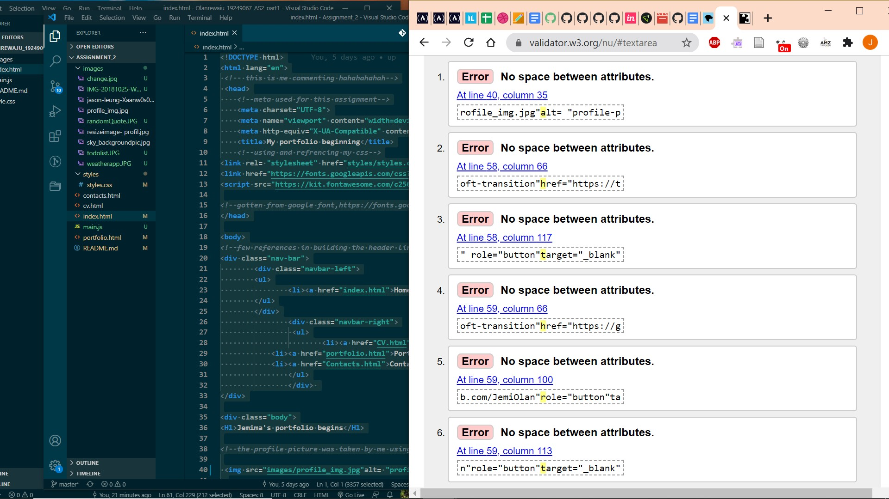

the other half of the html problem, part 2
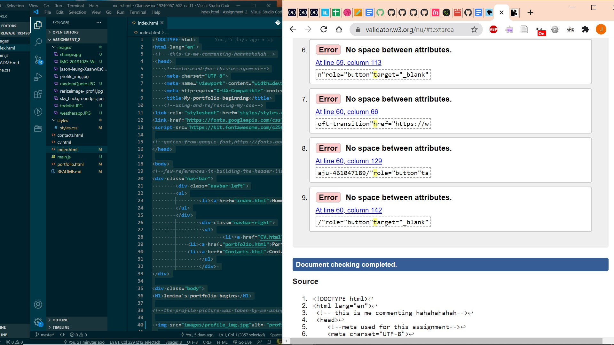

this shows the fixing process done by deleting excess div and spaces and slashes and proof its been fixed
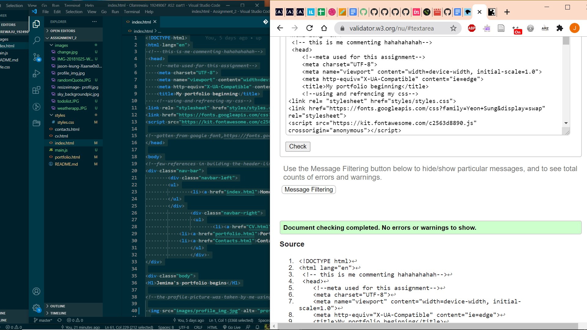

this shows there was no error on the portfolio when i used the css validation
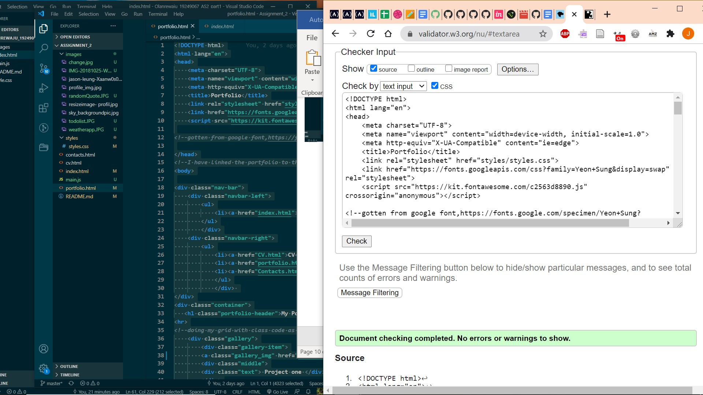

this shows the current error 
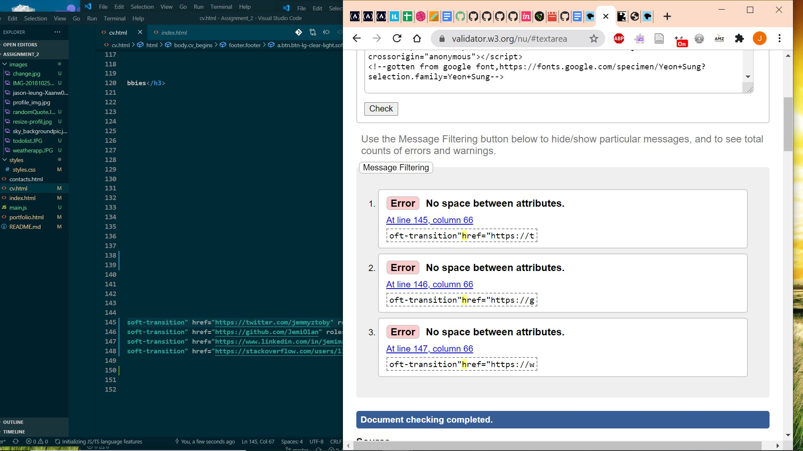

this shows all the error have been fixed
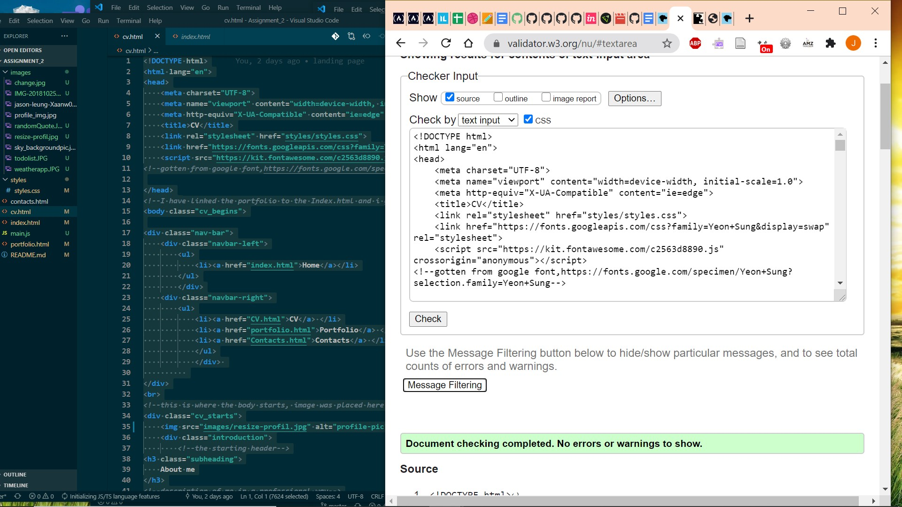

part of the contact errors part 1
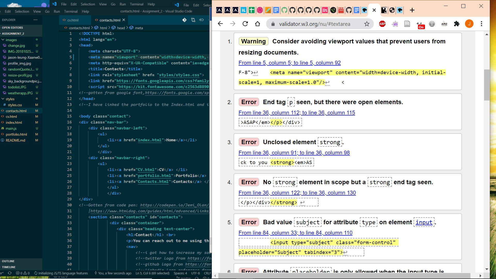

part of the contact errors part 2
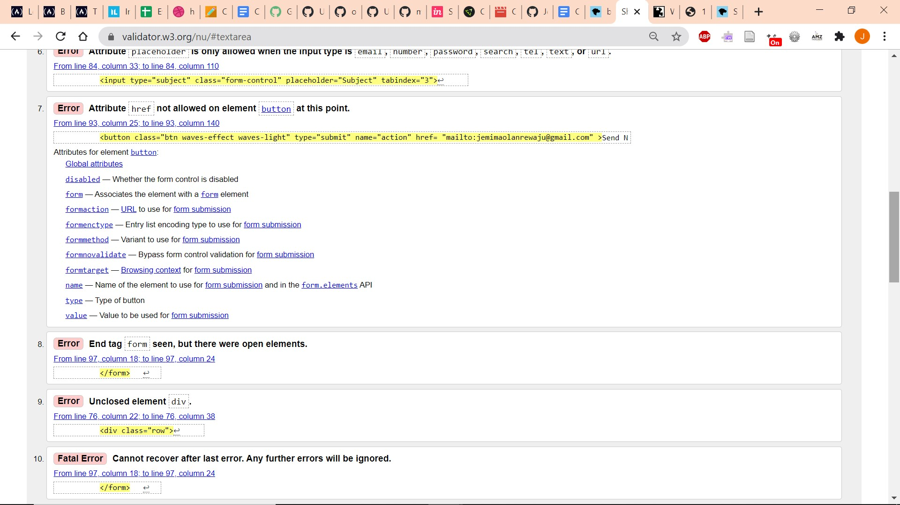

this shows contact error being fixed 
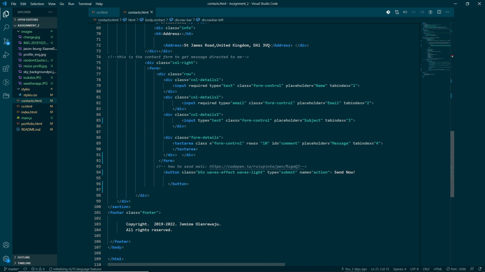

this shows contact error has been fixed 
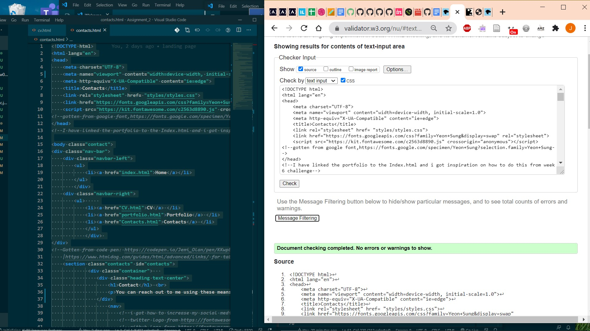
part of the html errors

i left the error because i wanted 100 as its shows absoluty to the webpage and avoiding unnecessary problems
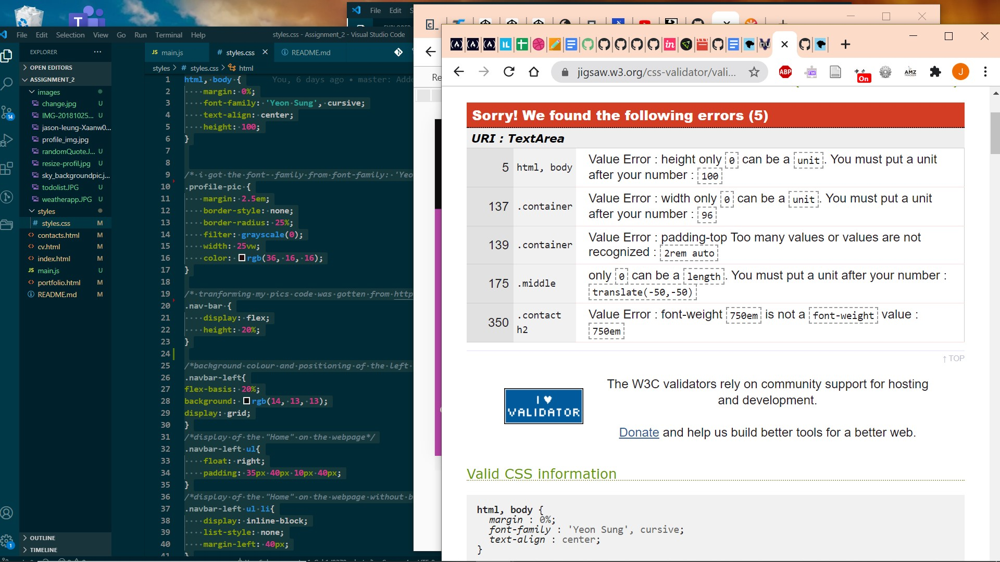

